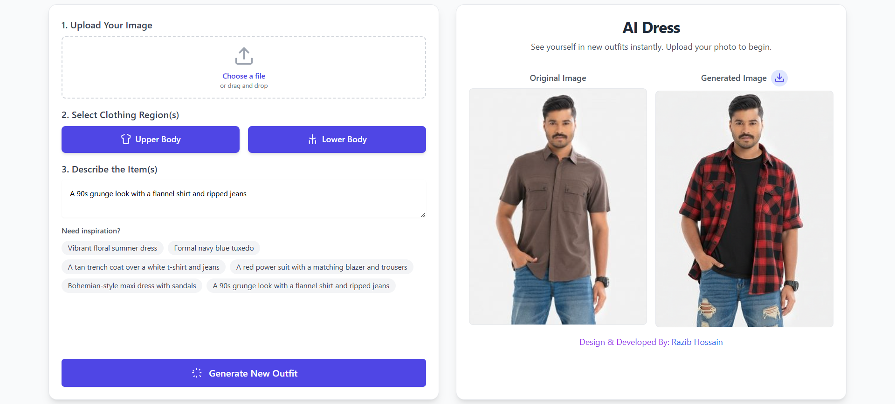

# AI Dress

A web application that allows you to virtually try on new clothing by uploading a photo and describing the outfit you want to see. 

## ✨ Features

- **Easy Image Upload:** Drag and drop your image or use the file picker.
- **Multi-Region Selection:** Choose to modify the upper body, lower body, or a full outfit.
- **AI-Powered Generation:** Describe any clothing item in natural language to generate a photorealistic result.
- **Dynamic Prompt Assistance:** Get creative ideas with "inspiration" hints that adapt to your selected clothing region.
- **Side-by-Side Comparison:** Instantly compare the original and newly generated images.
- **Download Your Look:** Save your favorite virtual outfits with a single click.
- **Responsive Design:** Works beautifully on both desktop and mobile devices.
- **Smart API Key Handling:** If your API key is missing or invalid, the app prompts you to enter it without needing to touch the code.

## 🚀 How It Works

- **Frontend:** Built with **React**, **TypeScript**, and styled with **Tailwind CSS**. It runs entirely in the browser using CDN-hosted libraries, requiring no installation or build process.
- **AI Model:** Utilizes the **Google Gemini API** (`gemini-2.5-flash-image-preview` model) for its powerful in-painting and image generation capabilities.

## 📋 Prerequisites

- A modern web browser (Chrome, Firefox, Safari, Edge).
- A **Google Gemini API Key**. You can get one for free from [Google AI Studio](https://aistudio.google.com/app/apikey).

## 🛠️ Installation & Setup

This application is designed to run directly in the browser without any complex setup or build steps.

1.  **Download the Code:**
    - Clone the repository or download the ZIP file containing all the project files (`index.html`, `index.tsx`, `App.tsx`, etc.).

2.  **Open the Application:**
    - Simply open the `index.html` file in your web browser.

3.  **Provide API Key:**
    - The application does not require you to set up environment variables.
    - The first time you try to generate an image, a dialog box will automatically appear prompting you to enter your Google Gemini API key.
    - Paste your key into the input field and click **"Save & Retry"**. The application will securely use this key for all subsequent requests during your session.

## 📖 How to Use

1.  **Upload Your Image:**
    - Drag and drop an image file onto the upload area, or click "Choose a file" to select one from your computer. A good source image should clearly show a person and their clothing.

2.  **Select Clothing Region(s):**
    - Click on the **"Upper Body"** or **"Lower Body"** buttons. You can select one or both to specify which part of the outfit you want to change.

3.  **Describe the New Outfit:**
    - In the text box, type a description of the clothing you want to see. For example, "a red silk dress" or "blue denim jeans and a white t-shirt".
    - If you need ideas, click on one of the **inspiration tags** below the text box. The suggestions will automatically update based on the region(s) you selected.

4.  **Generate:**
    - Click the **"Generate New Outfit"** button. The AI will start processing your request, which may take a few moments.

5.  **View and Download:**
    - The newly generated image will appear in the "Generated Image" box.
    - Click the **download icon** next to the title to save the image to your device.

## 🔧 Troubleshooting

-   **"API Key Required" Dialog:** If you see this dialog, it means your key is missing, invalid, or has expired. Please ensure you have copied the correct key from Google AI Studio and paste it into the field.
-   **Image Not Generating / Error Message:** The AI model may refuse to generate an image if the prompt violates its safety policies (e.g., requests for inappropriate content). If you receive an error like "No image was generated," please try a different, more descriptive prompt.
-   **App Doesn't Load:** Ensure you are opening the `index.html` file and that all other project files (`index.tsx`, `App.tsx`, etc.) are located in the same directory structure.
